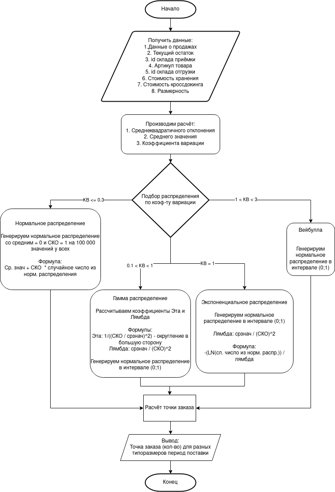

# Концепция близжайшего развития

## Ozon

### Дата поствки кроссдокинга

1. Получение данных о продажах
2. Приведение исследуемых данных к формату вариационного ряда + получение показателя запаса на текущий момент + получение данных о вместимости коробок+данные о времени доставки до складов+целевой показатель вероятности дефицита
3. Расчёт:
- среднеквадратичного отклонения
- среднего значения
- коэффициента вариации

4. Подбор распределения по коэф-ту вариации:

#### КВ <= 0.3 – нормальное распределение

Генерируем нормальное распределение со средним = 0 и СКО = 1 на 100 000 значений у всех
Формула: Ср.знач + СКО * случайное число из норм. распределения 

#### 0.3 < КВ < 1 – гамма распределение

Рассчитываем коэффициенты эта и лямбда по формулам:
Эта - 1/((СКО/срзнач)^2) – округляем в большую сторону
Лямбда – срзнач / (СКО)^2
Генерируем равномерное распределение в интервале (0;1)
Формула: (-1 / лямбда)этаLN(1 – сл. Числ из равн расп)

#### КВ = 1 экспоненциальное распределение

Генерируем равномерное распределение в интервале (0;1)
Лямбда – срзнач / (СКО)^2
Формула: -(LN(сл числ из равн расп.)) / лямбда

#### 1 < КВ < 3 - вейбулла

Генерируем равномерное распределение в интервале (0;1)

> С распределением вейбула есть проблемы, так как не понятно, как определять значения коэф-ов больших 1.
> Табличные значения есть до КВ = 1, но в нашей ситуации оно работает при больших значениях.
> Есть библа reliability, в которой присутствуют интересные инструменты автоматического подтягивания коэф-ов для всех распределений, но непонятно, как она работает.

5. Процесс моделирования:

Перед процессом моделирования будет расчёт показателей поставки и подбор стратегии, но пока его нет. Но он будет. Правда-правда. Точно-точно. 
Подтянув показатель запаса, последовательно вычитаем из него сгенерированнные в шаге 3 значения потребления. 
Когда значение достигает точки заказа, отсчитываем количество итераций, равное времени поставки 
Считаем коэффициент дефицитов для данной крит точки – кол-во не дефицитов делим на общее количество рассчитаных поставок. 
Если показатель дефицита ниже целевого, увеличиваем размер точки заказа, повторяем процесс

#### Блок схема

